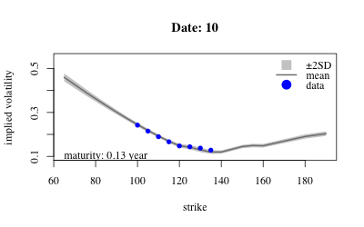

# GP-LV
Gaussian process local volatility model.

Code accompanies this [paper](https://arxiv.org/abs/1901.06021) by Martin Tegner and Stephen Roberts.

## Install

Clone and enter the repo.

```bash
git clone https://github.com/martnj/GP-LV
cd GP-LV
```

## Datasets

`data/data_gp_lv.Rdata` contains a synthetic dataset with price and implied volatility surfaces from a single date. 


Similarly, `data/data_sequence_gp_lv.Rdata` contains a sequence of synthetic surfaces from ten dates.

## Functions

Functions in `functions_gp_lv.R` include MCMC samplers, GP covariance functions and prediction equations, Black-Scholes and local volatility pricing functions.

```bash
> Ts = c(0.1, 0.25, 0.5, 1, 2, 3)
> Ks = c(90, 95, 100, 105, 110, 115, 120)
> LV = matrix(0.25, nrow=length(Tgrid), ncol=length(Kgrid))
> localVolCalls(S0=100, rf=0.015, q=0.02, LV=LV, Kgrid=Ks, Tgrid=Ts, KflatExt=100*seq(0.1, 4, by=0.2), impVol=TRUE)
```
will produce a 6x7 matrix with implied volatilities (`impVol=FALSE` for prices) over Tgrid x Kgrid:

```bash
          [,1]      [,2]      [,3]      [,4]      [,5]      [,6]      [,7]
[1,] 0.2098161 0.2214284 0.2642055 0.2252830 0.2334082 0.2474540 0.2583035
[2,] 0.2123303 0.2414574 0.2370104 0.2504015 0.2439533 0.2406356 0.2383015
[3,] 0.2265204 0.2329941 0.2438070 0.2409527 0.2449153 0.2443306 0.2413687
[4,] 0.2386151 0.2419249 0.2400347 0.2442403 0.2427800 0.2427263 0.2423808
[5,] 0.2464329 0.2453425 0.2472783 0.2447980 0.2456464 0.2450801 0.2442844
[6,] 0.2474535 0.2480237 0.2462238 0.2476969 0.2465076 0.2463319 0.2461990
```

## Demo

`main_gp_lv.R` contains a demo:

* **Model setup:** Definitions of link function, likelihood, GP-prior (wrappers for cov. functions) and hyperprior.
* **Data:** Load synthetic dataset from single date.
* **MCMC algorithm:** Posterior sampling of local volatility and hyperparameters from price surface of a single date.
* **Results:** Extract variables from MCMC sample; confidence envelope over local vol (in 3D) and implied vol (2D cross-sections).


Sequential sampling with serial data: 

* **Data series:** Load synthetic datasets.
* **Sequential MCMC algorithm:** Sequential sampling of local volatility and hyperparameters from series of price-surfaces.
* **Results:** Extract variables from sample and look at posterior over implied volatility at *earliest* maturity of each date.

 
 
 
 
 

